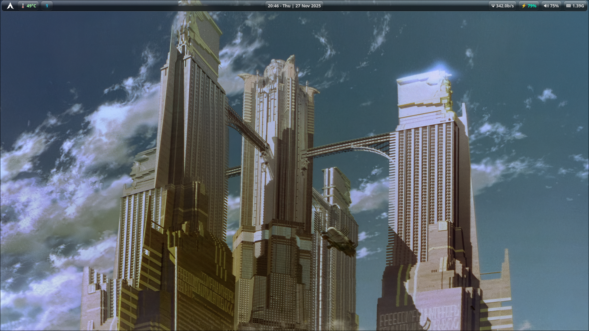
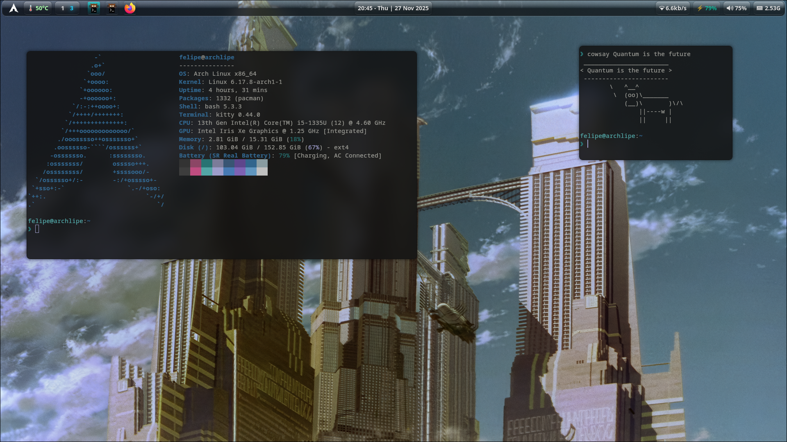
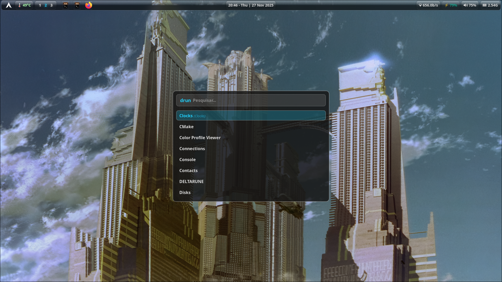
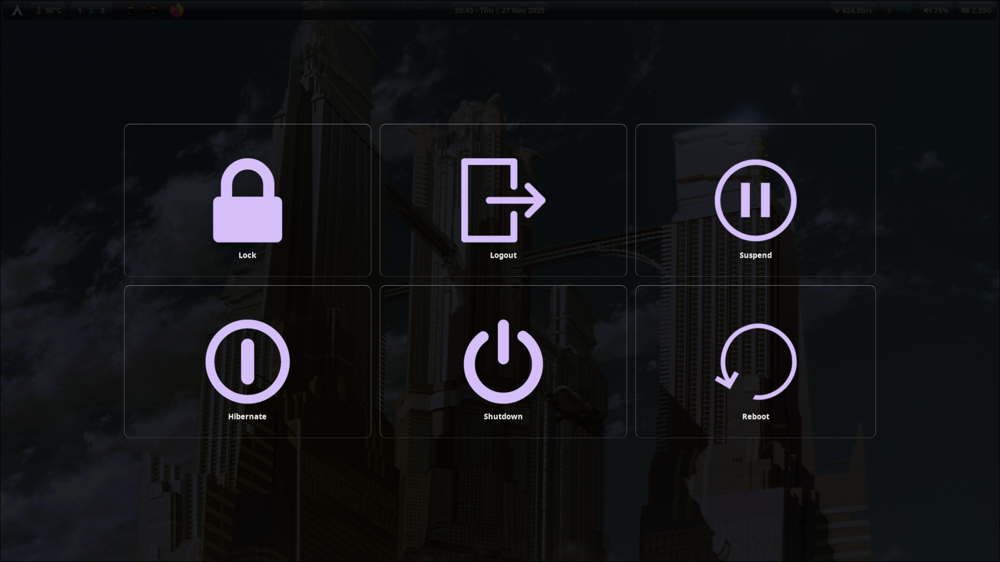

# FelipeEd Dotfiles

> Arch Linux | Hyprland

My personal Hyprland configuration with a translucent glassy aesthetic, based on [diinki's frutiger aero theme](https://github.com/diinki/diinki-aero).






## About

This setup assumes you're already familiar with Hyprland on Arch Linux. These are my personal configurations, which means some settings are specific to my hardware (monitor layouts, touchpad behavior, etc.). You'll need to review and modify `hypr/.config/hypr/conf.d/` and other files to match your system.

The theme focuses on a translucent, glassy aesthetic with smooth animations and a cohesive cyan accent color throughout all components.

## Configurations

- **Hyprland** - Custom keybinds, window rules, and animations
- **Hyprlock** - Lockscreen with styled layout
- **Hypridle** - Idle management and auto-lock
- **Hyprpaper** - Wallpaper manager configuration
- **Waybar** - Glassy status bar styling with system info modules
- **Rofi** - Translucent launcher theme matching the aesthetic
- **Wlogout** - Styled power menu layout
- **Kitty** - Terminal color scheme and font settings
- **Starship** - Custom prompt design
- **Fastfetch** - Personalized system info display

## Installation

First, install the required packages:

```bash
sudo pacman -S hyprland hyprlock hypridle hyprpaper waybar rofi wlogout kitty starship fastfetch stow ttf-noto-nerd ttf-jetbrains-mono-nerd
```

Clone this repository and use GNU Stow to symlink the configurations:

```bash
git clone https://github.com/YOUR_USER/dotfiles.git ~/dotfiles
cd ~/dotfiles

# Backup your existing configs
mkdir -p ~/.config-backup
cp -r ~/.config/{waybar,wlogout,rofi,hypr,kitty,starship,fastfetch} ~/.config-backup/ 2>/dev/null

# Important: Update wallpaper paths in hyprpaper.conf and hyprlock.conf to point to your own wallpapers

# Symlink everything with stow
stow */
```

### How Stow Works

GNU Stow creates symlinks from this repository to your `~/.config` directory. Each folder here (waybar, hypr, etc.) contains a `.config` directory that mirrors where the files should go in your home directory. This means:

- Changes you make to files in `~/dotfiles` are instantly reflected in your actual configs
- You can easily track and version control your configurations
- Uninstalling is as simple as `stow -D */`

If you only want specific configurations, you can stow them individually:

```bash
stow waybar rofi kitty  # Only these three
```

## License

MIT License - Feel free to use and modify as you wish.
